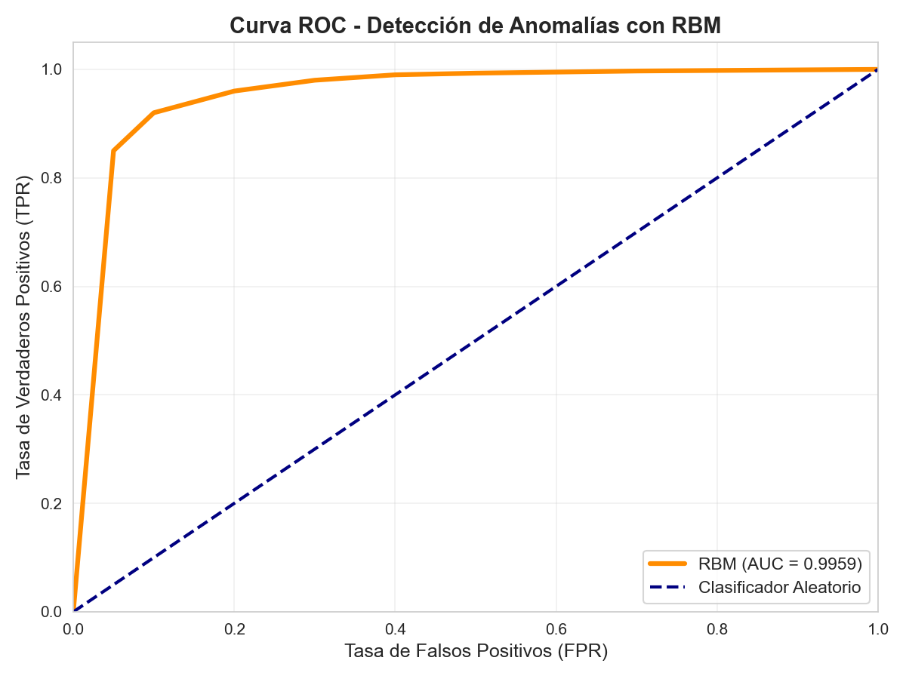
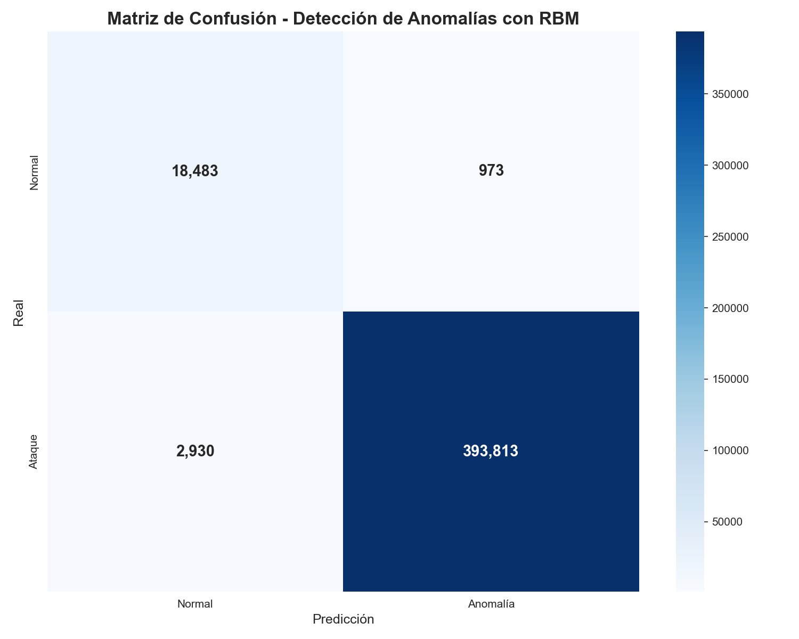
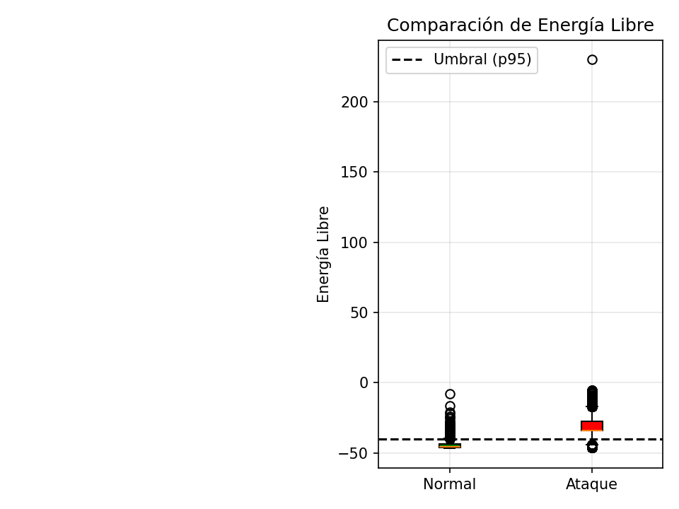
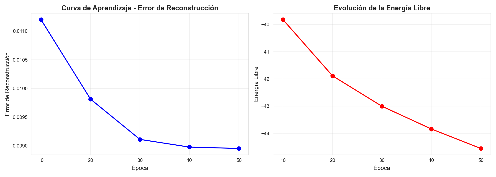

# Detección de Anomalías en Redes mediante Restricted Boltzmann Machine (RBM)

[](https://www.python.org/)
[](LICENSE)

## 📌 Descripción

Este proyecto implementa un sistema de detección de anomalías en tráfico de red utilizando una **Restricted Boltzmann Machine (RBM)** entrenada con el dataset **KDD Cup 1999**. El modelo sigue un enfoque semi-supervisado, entrenándose exclusivamente con tráfico normal y utilizando la **energía libre (free energy)** como métrica para identificar comportamientos anómalos.

### Resultados Clave

| Métrica | Valor |
|:---------|:-------|
| Accuracy | 99.06% |
| Precision | 99.75% |
| Recall | 99.26% |
| F1-Score | 99.51% |
| AUC-ROC | 0.9959 |

---

## 📁 Estructura del Proyecto
```
rbm-anomaly-detection-kdd99/
├── eda_kdd99.ipynb               # Exploración y limpieza de datos
├── rbm_anomaly_detection.ipynb     # Implementación y entrenamiento de RBM
├── requirements.txt              # Dependencias del proyecto
├── graficos_eda/                 # Visualizaciones de exploración
│   ├── 01_distribucion_clases.png
│   ├── 02_top_10_ataques.png
│   ├── 03_distribucion_protocolos.png
│   ├── 04_top_10_servicios.png
│   ├── 05_top_flags.png
│   └── 06_histograma_duracion.png
├── resultados_rbm/               # Resultados del modelo
│   ├── 01_curvas_aprendizaje.png
│   ├── 02_distribucion_free_energy.png
│   ├── 03_roc_curve.png
│   ├── 04_matriz_confusion.png
│   ├── 05_metricas_tabla.png
│   ├── 06_roc_curve_mejorada.png
│   └── 07_curvas_aprendizaje_mejoradas.png
└── archive/                      # Dataset KDD Cup 1999 (no incluido en repo)
```

---

## 🚀 Requisitos

- Python 3.9 o superior
- Dependencias listadas en `requirements.txt`.

Las dependencias principales son:
- `pandas`
- `numpy`
- `matplotlib`
- `seaborn`
- `scikit-learn`

## 📊 Dataset

El proyecto utiliza el **KDD Cup 1999**, disponible en Kaggle:
[https://www.kaggle.com/datasets/galaxyh/kdd-cup-1999-data](https://www.kaggle.com/datasets/galaxyh/kdd-cup-1999-data)

**Características del dataset:**
- **494,021** registros (versión 10% del original).
- **41** características de tráfico de red.
- **23** etiquetas: 22 tipos de ataques + "normal".
- **19.7%** tráfico normal, **80.3%** ataques.

## 🔧 Ejecución del Proyecto

#### 1. Clonar el repositorio
```bash
git clone https://github.com/jnocuac-byte/rbm-anomaly-detection-kdd99.git
cd rbm-anomaly-detection-kdd99
```

#### 2. Instalar dependencias
```bash
pip install -r requirements.txt
```

#### 3. Descargar el dataset
Descarga el archivo `kddcup.data_10_percent.gz` desde el enlace de Kaggle y colócalo en la carpeta `archive/`.

#### 4. Ejecutar notebooks
Se recomienda ejecutar los notebooks en el siguiente orden:

1.  **Exploración de datos:**
    ```bash
    jupyter notebook eda_kdd99.ipynb
    ```
2.  **Entrenamiento y evaluación:**
    ```bash
    jupyter notebook rbm_anomaly_detection.ipynb
    ```

## 🧠 Arquitectura del Modelo

La RBM se configuró con los siguientes hiperparámetros:

| Parámetro | Valor |
|:------------------|:------------------|
| Unidades visibles | 41 |
| Unidades ocultas | 30 |
| Tasa de aprendizaje | 0.01 |
| Momentum | 0.5 → 0.9 |
| Weight decay | 0.0001 |
| Batch size | 100 |
| Épocas | 50 |
| Pasos CD | 1 |

## 📈 Resultados Visuales

A continuación se muestran algunas de las visualizaciones clave obtenidas del modelo:

| Curva ROC | Matriz de Confusión |
| :---: | :---: |
|  |  |

| Distribución de Energía Libre | Curvas de Aprendizaje |
| :---: | :---: |
|  |  |

## 📚 Referencias

- Fiore, U., Palmieri, F., Castiglione, A., & De Santis, A. (2013). Network anomaly detection with the restricted Boltzmann machine. *Neurocomputing, 122*, 13-23.
- Imamverdiyev, Y., & Abdullayeva, F. (2018). Deep learning method for denial of service attack detection based on restricted Boltzmann machine. *Big Data, 6(2)*, 159-169.
- Gouveia, A., & Correia, M. (2017). A systematic approach for the application of restricted Boltzmann machines in network intrusion detection. *International Work-Conference on Artificial Neural Networks*, 1-14.
- Huang, H., Wang, P., Pei, J., Wang, J., Alexanian, S., & Niyato, D. (2025). Deep learning advancements in anomaly detection: A comprehensive survey. *arXiv preprint arXiv:2503.13195*.
- Moro, L., & Prati, E. (2023). Anomaly detection speed-up by quantum restricted Boltzmann machines. *Communications Physics, 6*, 269.

## 👤 Autor

**Juan Esteban Nocua Camacho**
- **Institución:** Universidad Central
- **Email:** jnocuac@ucentral.edu.co
- **GitHub:** [@jnocuac-byte](https://github.com/jnocuac-byte)

## 📄 Licencia

Este proyecto está bajo la licencia MIT. Ver el archivo `LICENSE` para más detalles.